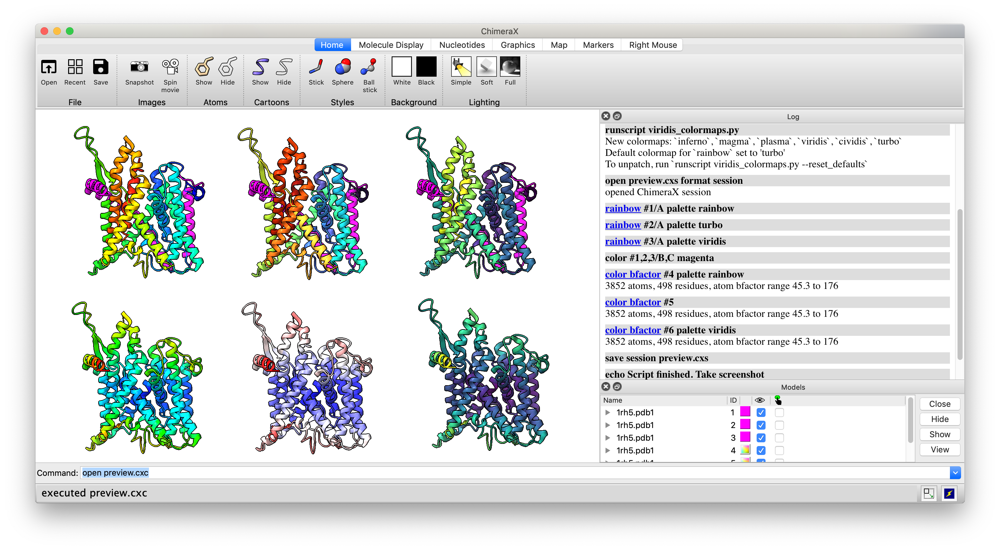

[](https://data.caltech.edu/badge/latestdoi/223877773)

chimerax_viridis
================

Script to add viridis and other colorblind-accessible
(and perceptually uniform) palettes to ChimeraX.
The default colormap for
[`rainbow`](http://rbvi.ucsf.edu/chimerax/docs/user/commands/color.html#sequential)
is set to
[`turbo`](https://ai.googleblog.com/2019/08/turbo-improved-rainbow-colormap-for.html).

All the new colormaps
([`viridis`, `magma`, `inferno`, `plasma`](https://bids.github.io/colormap),
[`cividis`](https://doi.org/10.1371/journal.pone.0199239),
`turbo`)
can be used in ChimeraX wherever builtin colormaps can be specified (docs for see
[`palette`](http://rbvi.ucsf.edu/chimerax/docs/user/commands/color.html#palette-options)),
e.g. instead of `... palette cyanmaroon ... `, try `... palette viridis ...`.

Just run `runscript viridis_colormaps.py` and you are off!



### Technical details

New color maps are added to the dictionary `colors.BuiltinColormaps` with their common
name as key and colormap constructed with `chimerax.core.colors.Colormap` as value.

The following functions in `chimerax.std_commands.color` use
`rainbow` by default  (i.e. when `cmap=None`, see snippet below)
and are monkey-patched with `turbo` instead.

    * `_set_sequential_polymer`
    * `_set_sequential_chain`
    * `_set_sequential_residue`
    * `_set_sequential_structures`

```python
    if cmap is None:
        from chimerax.core import colors
        cmap = colors.BuiltinColormaps["rainbow"]
```

The new colormaps are added via their 256-hex colors
from [bokeh.palettes](https://github.com/bokeh/bokeh/blob/b19f2c5/bokeh/palettes.py)
(not via named colors)
to stay as true as possible to the original colormap specifications.
